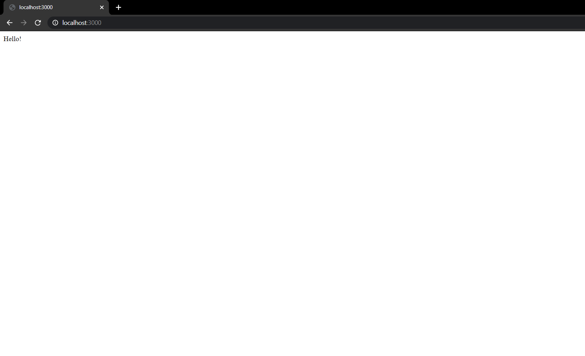

# NodeJS-basic-auth-API
A basic authentication API built using Express, Joi, MongoDB (Mongoose). This isn't built with HTML pages, rather it is just an API which contains POST Request.

## How to Run ?
Clone this repo into your computer/laptop and install the required dependencies, and you can start the server on your computer using the command "npm start". You can access it on 
your computer/laptop using the url https://localhost:3000/ and this will redirect you to a page as shown in the image below. Make sure you have NodeJS installed on your laptop/comp
uter.

<h2>Happy Coding!</h2>
